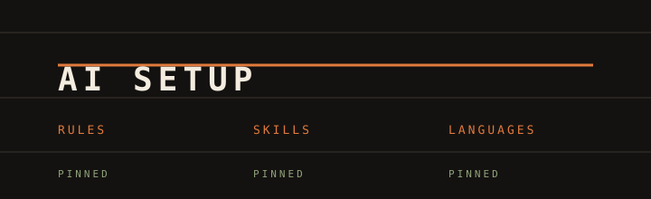
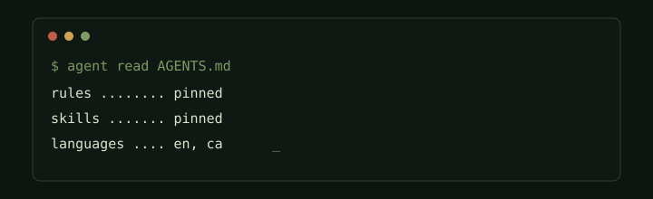

# AI Setup

Kit for starting a project with a coding agent (Cursor, Claude Code, Codex, OpenCode, Gemini CLI, GitHub Copilot). There is no application here. There is a project-file template and a reviewed, commit-pinned catalog of skills.

Four header options are below. Each one is an SVG in `assets/`. Say which number to keep.

<p align="center">
  <strong>1 · Copper</strong><br>
  
</p>

<p align="center">
  <strong>2 · Terminal</strong><br>
  
</p>

<p align="center">
  <strong>3 · Cards</strong><br>
  
</p>

<p align="center">
  <strong>4 · Lanes</strong><br>
  
</p>

<p align="center">
  <a href="#english">English</a>
  &nbsp;·&nbsp;
  <a href="#català">Català</a>
</p>

# English

An agent already knows how to write code. It does not know how this team works: which files it must not touch, which languages the interface speaks, when a change counts as finished, or which third-party instructions it is allowed to install. That is what these files are for. They are short on purpose. Everything in them is loaded into the conversation, so a vague rule crowds out a useful one.

## What is in this repo

| File | Who it is for | What you do with it |
| --- | --- | --- |
| [`RESOURCES/MDs/AGENTS.template.md`](RESOURCES/MDs/AGENTS.template.md) | Each new repo | Copy it to `AGENTS.md` and fill in the blanks. |
| [`RESOURCES/SKILLS/catalog.json`](RESOURCES/SKILLS/catalog.json) | The installer | Allowlist of skills, each pinned to a reviewed commit. |
| [`RESOURCES/SKILLS/skills.mjs`](RESOURCES/SKILLS/skills.mjs) | Each project | Installs from that catalog and checks the hash. |
| [`RESOURCES/SKILLS/README.md`](RESOURCES/SKILLS/README.md) | Anyone adding a skill | How to install, verify and update the catalog. |

Skills come only from that catalog, each one pinned to a commit, and never from a bare `npx skills add` against whatever `main` contains that day.

## Start a project

1. Copy `RESOURCES/MDs/AGENTS.template.md` to `AGENTS.md` in the new repo.
2. Replace every `<...>` and delete the lines that do not apply. The useful parts are the ones an agent cannot guess: how to install and run the app, when a change is done, the repo map, and the files it must ask about before editing.
3. Fill in **Languages**. This section is where the team decides the documentation languages and the interface languages, including how the language switcher behaves.
4. Point Claude Code at the same file, so there is a single source. From the repo root:

   ```bash
   ln -s AGENTS.md CLAUDE.md
   ```

5. Commit `AGENTS.md`. When the agent keeps making the same mistake, add one line under **Known pitfalls**. That section is the memory of the repo.

Keep the file under about 100 lines. If a rule would be true in every repository, it belongs in the person's own agent rules, not in the project file.

Install skills from this kit, not with `npx skills add`. From the project you are setting up:

```bash
node ~/Projects/ai-setup-daw2-monstia/RESOURCES/SKILLS/skills.mjs install
```

See [`RESOURCES/SKILLS/README.md`](RESOURCES/SKILLS/README.md) for detect, verify and catalog updates.

## Languages

Three different things, three different rules:

- **The reply.** The agent answers in the language of the message it just received. The language of these files does not count, and neither does the language of the code. If you write in Catalan, you get Catalan back. If a teammate writes in English in the same repo, they get English.
- **The code.** Identifiers, filenames, branches, comments, commits and internal errors are English, whoever is talking.
- **Docs and UI.** Only the languages listed in that project's `AGENTS.md`. The agent does not add or drop a language on its own, and it does not write interface copy straight into the components: it goes through the project's i18n system, in every active language.

---

# Català

Un agent ja sap escriure codi. No sap com treballa aquest equip: quins fitxers no ha de tocar, en quines llengües parla la interfície, quan un canvi es considera acabat, ni quines instruccions de tercers pot instal·lar. Per a això serveixen aquests fitxers. Són curts a propòsit. Tot el que hi ha dins es carrega a la conversa, així que una regla vaga treu lloc a una d'útil.

## Què hi ha al repo

| Fitxer | Per a qui | Què en fas |
| --- | --- | --- |
| [`RESOURCES/MDs/AGENTS.template.md`](RESOURCES/MDs/AGENTS.template.md) | Cada repo nou | Copia'l a `AGENTS.md` i omple els buits. |
| [`RESOURCES/SKILLS/catalog.json`](RESOURCES/SKILLS/catalog.json) | L'instal·lador | Llista permesa de skills, cadascuna fixada a un commit revisat. |
| [`RESOURCES/SKILLS/skills.mjs`](RESOURCES/SKILLS/skills.mjs) | Cada projecte | Instal·la des d'aquest catàleg i comprova el hash. |
| [`RESOURCES/SKILLS/README.md`](RESOURCES/SKILLS/README.md) | Qui afegeixi una skill | Com instal·lar, verificar i actualitzar el catàleg. |

Les skills surten només d'aquest catàleg, cadascuna fixada a un commit, i mai d'un `npx skills add` pelat contra el que hi hagi aquell dia a `main`.

## Obre un projecte

1. Copia `RESOURCES/MDs/AGENTS.template.md` a `AGENTS.md` dins del repo nou.
2. Substitueix cada `<...>` i esborra les línies que no s'apliquin. Les parts útils són les que un agent no pot endevinar: com s'instal·la i s'engega l'app, quan un canvi està fet, el mapa del repo i els fitxers que ha de preguntar abans de tocar.
3. Omple **Languages**. Aquesta secció és on l'equip decideix les llengües de la documentació i les de la interfície, inclòs el comportament del selector d'idioma.
4. Fes que Claude Code llegeixi el mateix fitxer, perquè només n'hi hagi una font. Des de l'arrel del repo:

   ```bash
   ln -s AGENTS.md CLAUDE.md
   ```

5. Fes commit d'`AGENTS.md`. Quan l'agent repeteixi el mateix error, afegeix una línia a **Known pitfalls**. Aquesta secció és la memòria del repo.

Mantén el fitxer per sota d'unes 100 línies. Si una regla valdria per a tots els repositoris, va a les regles pròpies de la persona, no al fitxer del projecte.

Instal·la les skills des d'aquest kit, no amb `npx skills add`. Des del projecte que estiguis preparant:

```bash
node ~/Projects/ai-setup-daw2-monstia/RESOURCES/SKILLS/skills.mjs install
```

A [`RESOURCES/SKILLS/README.md`](RESOURCES/SKILLS/README.md) hi ha detect, verify i l'actualització del catàleg.

## Llengües

Tres coses diferents, tres regles diferents:

- **La resposta.** L'agent contesta en la llengua del missatge que acaba de rebre. No compta la llengua d'aquests fitxers, ni la del codi. Si escrius en català, et respon en català. Si un company escriu en anglès al mateix repo, a ell li respon en anglès.
- **El codi.** Identificadors, noms de fitxer, branques, comentaris, commits i errors interns van en anglès, parli qui parli.
- **Documentació i interfície.** Només les llengües que indiqui l'`AGENTS.md` d'aquell projecte. L'agent no afegeix ni treu cap llengua pel seu compte, i no escriu els textos de la interfície directament als components: passen pel sistema d'i18n del projecte, en totes les llengües actives.
